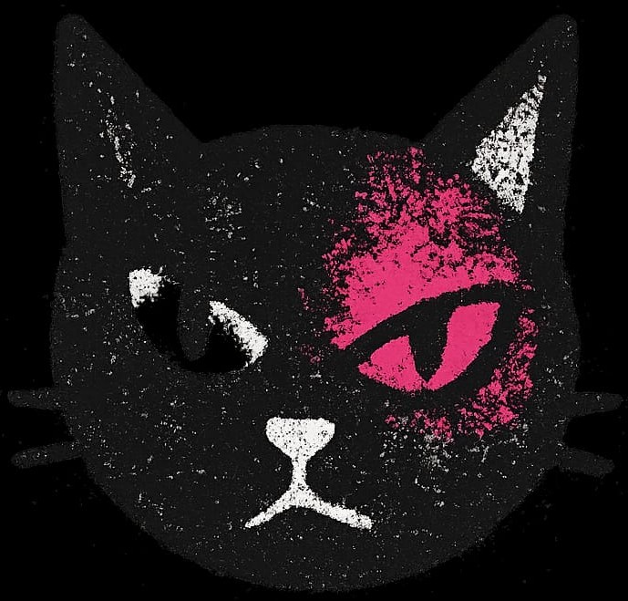

# Copycat

> **"Originality is overrated."**

**Copycat** is a raw, industrial-style meme generator that interfaces with the infinite chaos of the **Cat as a Service (CATAAS)** API. It abandons modern, polished aesthetics for a gritty "Xerox/Zine" vibe, serving as a functional engine for feline replication and text injection.



## ⚡ Features

### 1. The Infinite Engine (Home)
- **Random Generation**: On every load, the system fetches a completely unique cat image from the CATAAS dataset.
- **Cache Busting Strategy**: Implements a custom `fetch` logic using `cache: 'no-store'` and binary `Blob` conversion to force the browser to ignore cached assets and always deliver fresh data.
- **Visuals**: Brutalist layout featuring the "Treadmill" loader from `ldrs`.

### 2. Meme Studio (/meme)
- **Text Injection**: Direct interface to the `/cat/says/:text` endpoint. Type a phrase, and the system stamps it onto a random cat.
- **Dynamic Preview**: Real-time fetching and rendering of generated binary data.
- **Programmatic Download**: A custom download handler that converts the ephemeral Object URL into a downloadable `.jpg` file client-side.

## 🛠️ Tech Stack

- **Core**: React 19 + Vite
- **Styling**: TailwindCSS 4.0
- **Typography**: Space Mono (Google Fonts)
- **Icons**: Lucide React
- **HTTP Client**: Native Fetch API (Optimized for Blob handling)
- **Routing**: React Router DOM 7

## 📂 Project Structure

```bash
src/
├── components/
│   ├── Header.jsx       # Global navigation and Brand mark
│   └── Hero.jsx         # The random cat generation logic
├── pages/
│   ├── Home.jsx         # Landing interface
│   └── Meme.jsx         # The meme creation studio
├── App.jsx              # Routing configuration
└── main.jsx             # Entry point
```

## 🚀 Getting Started

1. **Clone the repository**
   ```bash
   git clone [https://github.com/jasondebnath001/copycat.git](https://github.com/jasondebnath001/copycat.git)
   cd copycat
   ```

2. **Install dependencies**
   ```bash
   npm install
   ```

3. **Ignite the engine**
   ```bash
   npm run dev
   ```

## 🧠 Technical Highlights

### Solving the API Caching Issue
Public APIs often cache images heavily. To ensure `Copycat` always generates a *new* image, we bypass standard `` tag caching by fetching the resource programmatically:

```javascript
// src/components/Hero.jsx
const response = await fetch("[https://cataas.com/cat](https://cataas.com/cat)", {
  cache: "no-store", // Force fresh request
});

const blob = await response.blob(); // Get raw binary data
const objectUrl = URL.createObjectURL(blob); // Create local ephemeral URL
setCatUrl(objectUrl);
```

## 🎨 Design System

The UI follows a strict **"Defective Xerox"** aesthetic:
- **Background**: `#f2f0f9` (Off-white paper)
- **Accents**: `#ff3366` (Neon Pink) & `#3d5afe` (Hyper Blue)
- **Borders**: Dashed, raw, and unpolished.
- **Font**: `Space Mono` for that typewriter/technical manual feel.

## 📄 License

Distributed under the MIT License. See `LICENSE` for more information.

---

*Powered by [CATAAS](https://cataas.com/)*
